# Mobile Optimized Dex Entry (M.O.D.E.)

> [!IMPORTANT]
> M.O.D.E. is a progressive web app designed for Pokémon collectors to rapidly categorize Pokedex checklists (regional or national) using a physics-driven swipe deck interface, featuring offline persistence, custom multi-gesture configurations, and a comprehensive spreadsheet analysis engine.

<p align="center">
  <strong>Offline-first Dex entry</strong> &bull;
  <strong>Physics-based 2D gesture engine</strong> &bull;
  <strong>Dexie-backed transactional updates</strong> &bull;
  <strong>Visual multi-set Query Builder</strong> &bull;
  <strong>Separated View-Hook Architecture</strong>
</p>

<p align="center">
  <strong>Live URL:</strong> <a href="https://projects.satish.com/project-mode">projects.satish.com/project-mode</a>
</p>

---

## Table of Contents

- [Why This Project Exists](#why-this-project-exists)
- [Who This README Is For](#who-this-readme-is-for)
- [Product Snapshot](#product-snapshot)
- [Screenshots & UI Previews](#screenshots--ui-previews)
- [Feature Overview](#feature-overview)
- [How The System Works](#how-the-system-works)
- [Application Features Tree](#application-features-tree)
- [Data Models (Dexie Schema)](#data-models-dexie-schema)
- [Example Use Case: Cross-Game Synchronization](#example-use-case-cross-game-synchronization)
- [Local Development](#local-development)
- [Tech Stack](#tech-stack)

---

## Why This Project Exists

For players managing collections across multiple Pokémon Switch titles, Pokémon GO, and Pokémon HOME, tracking progress is a fragmented mess. Each game hosts its own regional or national Pokédex, while Pokémon HOME tracks each game's dex separately alongside its own National Dex. Spread across different consoles and systems, it is impossible to perform even basic cross-game queries—such as identifying which Pokémon currently in your Pokémon GO dex are still missing from your Pokémon HOME GO dex.

**M.O.D.E. (Mobile Optimized Dex Entry)** consolidates all of your Pokédexes into a single, unified local database. By doing so, you can filter and analyze cross-game gaps to see exactly which Pokédexes you can complete right now by simply moving your Pokémon around.

To make the entry process fast and seamless on mobile, M.O.D.E. replaces tedious spreadsheets with a physics-driven swipe deck:

- **Rapid Swiping:** Swipe cards left, right, up, or down, or double-click to categorize entries in milliseconds.
- **Custom Gestures:** Define what each swipe direction means (e.g. Left = *Caught*, Right = *Missing*, Up = *To Evolve*, Down = *Trade*).
- **Tabular Spreadsheet Analysis:** Query, filter, and view swiped cards with full nested property search (e.g., matching stats or type arrays) offline.
- **Zero Network Dependency:** After loading Pokedex cards once, all operations run entirely in local client storage.

---

## Who This README Is For

| Audience | Start Here | Why |
| --- | --- | --- |
| **End Users** | [Product Snapshot](#product-snapshot) | Discover the features and learn how to use the swipe tools. |
| **Developers / Reviewers** | [How The System Works](#how-the-system-works) | Inspect the 2D gesture math, database joins, and refactored architecture. |
| **Contributors** | [Local Development](#local-development) | Clone the project, run it locally, and start coding. |

---

## Product Snapshot

### What users can do

| Area | What it offers |
| --- | --- |
| **Dashboard** | View active/completed snapshots, create new sessions, delete records, and upload previously exported snapshot JSON files. |
| **Active Swiper** | Swipe Pokemon cards horizontally or vertically, double click cards, trigger automated swipe remaining, or undo the last choice. |
| **Completed Summary** | View tabular columns of left vs. right categorizations, restart sessions, and export sessions to clean JSON backups. |
| **Tabular Analysis** | Join selected sessions, sort entries, search Pokemon details by name, type or stats, and expand collapsible JSON trees. |
| **Visual Query Builder** | Construct intersection, union, and difference query blocks (AND, OR, NOT) visually on nested JSON structures. |

### Key Interactions
- **Swipe Deck UX:** Tinder-style drag gesture deck to sort Pokémon cards quickly.
- **Visual Edge Glows:** Responsive screen border glows that fade in matching drag coordinates (Green for Left, Red for Right, White/Gray for vertical).
- **Dynamic Action Layouts:** Control panel dynamically adjusts between compact rows and grids depending on how many vertical/double-click gestures you enable (2 to 5 buttons).
- **Morphing Controls:** Glassmorphic buttons that expand/collapse into clean icons during scroll to maximize screen space.
- **Trapped-Focus Bottom Sheets:** Reusable sliding drawers for filters and visual queries that prevent background scrolling, close on backdrop click, and support keyboard Escape cancels.

---

## 💡 Example Use Case: Cross-Game Synchronization

Here is a step-by-step example of how to solve the common challenge of finding transfer candidates from Pokémon GO to Pokémon HOME:

### Step 1: Record your Pokémon GO National Dex
1. Click **New Snapshot** on the Dashboard.
2. Set the Title to `PoGo_Nat_Dex`.
3. Choose the Pokedex Regional Dex (e.g. National Dex).
4. Configure Left Swipe as `Caught` and Right Swipe as `Missing`.
5. Click **Create Snapshot**.
6. Go through the card deck, swiping Left (`Caught`) for Pokémon you have registered in your Pokémon GO game, and Right (`Missing`) for those you do not.

### Step 2: Record your Pokémon HOME GO Dex
1. Return to the Dashboard and click **New Snapshot** again.
2. Set the Title to `Home_Go_Dex`.
3. Choose the same Pokedex option.
4. Configure Left Swipe as `Caught` and Right Swipe as `Missing`.
5. Click **Create Snapshot**.
6. Swipe through the deck, swiping Left (`Caught`) for Pokémon registered in your HOME Pokémon GO dex, and Right (`Missing`) for those missing.

### Step 3: Run the cross-game comparison query
1. Navigate to the **Analyse** tab from the main menu.
2. Open the **Visual Query Builder** by clicking the floating icon in the top-right corner (represented by the QR-code-like block icon).
3. Construct the query block:
   - Select the `PoGo_Nat_Dex` session checkbox.
   - Click the **Caught** status checkbox.
4. Click **Add Filter Block** to add a relational query block.
5. In the new block:
   - Select the `Home_Go_Dex` session checkbox.
   - Click the **Missing** status checkbox.
6. Click **Apply Query** (or click **Save Query** to library for later use).

### The Result
The spreadsheet dynamically filters down to show you only the Pokémon that are **Caught in Pokémon GO** but are **Missing in Pokémon HOME**. You can now use this exact list of names and ID numbers to transfer those specific Pokémon from your GO app to your HOME storage to complete your Pokedex!

---

## Screenshots & UI Previews

### Dashboard

<details>
  <summary><strong>View Dashboard Screens</strong></summary>
  <br />
  <table>
    <tr>
      <td align="center">
        
        <br /><sub>Active & Completed Sessions</sub>
      </td>
      <td align="center">
        
        <br /><sub>New Snapshot Setup</sub>
      </td>
    </tr>
  </table>
</details>

### Swipe Deck

<details>
  <summary><strong>View Active Swiping Deck</strong></summary>
  <br />
  <table>
    <tr>
      <td align="center">
        
      </td>
      <td align="center">
        
      </td>
    </tr>
    <tr>
      <td align="center" colspan="2">
        <br /><sub>Active Deck with Glow Overlays</sub>
      </td>
    </tr>
  </table>
</details>

### Spreadsheet Analysis & Query Builder

<details>
  <summary><strong>View Analysis spreadsheet & Query Builder</strong></summary>
  <br />
  <table>
    <tr>
      <td align="center">
        
        <br /><sub>Interactive Spreadsheet with JSON expansion</sub>
      </td>
      <td align="center">
        
        <br /><sub>Visual Multi-Set Query Block Builder</sub>
      </td>
      <td align="center">
        
        <br /><sub>Filters</sub>
      </td>
    </tr>
  </table>
</details>

---

## Feature Overview

### Swipe Gestures & Controls

| Direction | Action | UI Glow | Customization |
| --- | --- | --- | --- |
| **Left** | Swipe Left / Left Button | Green | Required (Always Active) |
| **Right** | Swipe Right / Right Button | Red | Required (Always Active) |
| **Up** | Swipe Up / Up Button | White | Optional (Configurable) |
| **Down** | Swipe Down / Down Button | Gray | Optional (Configurable) |
| **Double Click** | Double Click Card / Fav Button | Pulse animation | Optional (Configurable) |

### Search & Filtering Tools

| Tool | Capability | Implementation |
| --- | --- | --- |
| **Full Text Search** | Matches Pokémon name, ID, types, or abilities instantly. | Local Javascript Filter |
| **Advanced Query blocks** | Intersects, unites, or subtracts custom conditions (e.g. `stats.speed > 100`). | Visual Query Builder + Local Set Math |
| **Column Sorting** | Click headers to sort by Name, ID, Primary type, or timestamp ascending/descending. | Lodash-style Array Sorters |
| **Collapsible JSON Tree** | Fully inspect nested Pokemon API JSON structures recursively with type highlighting. | Collapsible Node Renderer |
| **Lazy Rendering (Infinite Scroll)** | Renders spreadsheet rows dynamically in batches of 50 as you scroll to prevent mobile viewport lag. | React Callback Ref + IntersectionObserver Sentinel |

---

## How The System Works

### 1. Data Source & Pokedex Caching
When a user launches a new session:
1. The app initializes the `PokemonAdapter` wrapper using `pokeapi-js-wrapper` internally.
2. It fetches basic Pokemon indices corresponding to the selected regional/debut dex (from 44 regional configuration options).
3. The adapter caches data locally. Heavy API fetch runs are only triggered during initial setups.

### 2. Physics-Based 2D Swipe Engine
Cards are wrapped in Framer Motion `<motion.div>` objects.
- **Drag Constraint:** If custom vertical gestures are active, 2D dragging is enabled (`drag={true}`). If only horizontal swipes are active, dragging is locked to the horizontal axis (`drag="x"`).
- **Coordinate Bindings:** The active card position is monitored using `x` and `y` motion values.
- **Edge Glow Opacity:** Four opacity transforms map physical coordinates to screen-wide overlay glows:
  - Left glow opacity maps `x` from `-30px` (0% opacity) to `-150px` (35% opacity).
  - Right glow opacity maps `x` from `30px` (0% opacity) to `150px` (35% opacity).
  - Top/Bottom glows map vertical coordinates similarly using `y` offsets.
- **Dominance Calculation:** On release (`onDragEnd`), the engine checks whether absolute `x` or absolute `y` displacement is larger. It triggers the swipe event on the dominant axis if the drag threshold is crossed; otherwise, the card springs back.

### 3. Database Joins (Version 3 Schema)
To keep search responsive, all swiping operations write records directly to **IndexedDB (via Dexie.js)**. In the `/analyse` sheet, records are aggregated using client-side joins:
```javascript
// Join Swipe Actions with Card Details and Session Designations
const actions = await db.swipeActions.where("sessionId").anyOf(selectedIds).toArray();
const cardDetailsList = await db.cardDetails.where("sessionId").anyOf(selectedIds).toArray();

const joinedRecords = actions.map(act => {
  const details = cardDetailsList.find(d => d.cardId === act.cardId)?.details;
  return { ...act, pokemonDetails: details };
});
```
This maps raw directions (left, right, etc.) to user-defined session titles on-the-fly, allowing a single view to display combined stats.

### 4. Lazy Rendering (Infinite Scroll) for Viewport Optimization
To support smooth scrolling on low-end mobile devices when joining massive Pokedex lists, M.O.D.E. implements dynamic lazy rendering (commonly known as **infinite scrolling**):
- **Pagination Chunking:** The analysis spreadsheet initializes with a slice of the first 50 matched Pokémon.
- **Sentinel Intersection Observation:** A bottom-aligned placeholder element acts as a scroll sentinel. An `IntersectionObserver` detects when this sentinel enters the visible viewport.
- **Dynamic Sentinel Binding:** To avoid stale closure reference issues when applying custom filter sets or query parameters, a React callback ref (`sentinelRef`) is utilized to disconnect and reconnect the observer dynamically to the correct sentinel node.
- **On-Demand Hydration:** When the sentinel is intersected, the visible slice count increments by 50 rows, rendering new data on-demand and keeping the browser's DOM weight minimal.


---

## 🌳 Application Features Tree

The following flowchart maps M.O.D.E.'s main features across its three primary functional screens:

```mermaid
graph TD
    App([M.O.D.E. PWA]) --> Dash[1. Dashboard Screen]
    App --> Analyse[2. Analyse Screen]
    App --> NewSnap[3. New Snapshot Screen]

    %% Dashboard Features
    Dash --> DashList[Active / Completed Snapshot Lists]
    Dash --> DashDel[Delete Snapshot Sessions]
    Dash --> DashJSON[Upload Snapshot JSON Backups]
    Dash --> DashRedirect[Redirect to Session Swiping]

    %% Analyse Features
    Analyse --> AnaSheet[Joined Pokedex Spreadsheet View]
    AnaSheet --> AnaLazy[Lazy Pagination Sentinel Observer]
    Analyse --> AnaSort[Column Sorters & Text Filter Search]
    Analyse --> AnaJson[Collapsible Pokemon Details JSON Tree]
    Analyse --> AnaQuery[Visual Set Query Builder AND / OR / NOT]
    AnaQuery --> AnaSaved[Save Queries Library to LocalStorage]

    %% New Snapshot Features
    NewSnap --> SnapTitle[Custom Snapshot Session Title]
    NewSnap --> SnapDex[Pokedex Selection 44 Options]
    NewSnap --> SnapGestures[Custom Gestures Enable/Disable]
    SnapGestures --> SnapLayouts[Adaptive Swiper Button Panel 2 to 5 actions]
    NewSnap --> SnapAuto[Auto Swipe Remaining & Transaction Log]
```



## Data Models (Dexie Schema)

Dexie is configured with three local database tables:

### 1. `sessions`
Stores metadata configuration details for each created snapshot:
- `id` (Primary Key, UUID string)
- `title` (string)
- `dexType` (string)
- `totalCards` (number)
- `status` (string, e.g. `"in-progress"` or `"completed"`)
- `createdAt` (timestamp number)
- `swipeLeftLabel` (string)
- `swipeRightLabel` (string)
- `doubleClickLabel` (optional string)
- `swipeUpLabel` (optional string)
- `swipeDownLabel` (optional string)

### 2. `swipeActions`
Logs every swipe registered by the user:
- `id` (Primary Key, Auto-incremented)
- `sessionId` (indexed string)
- `cardId` (string)
- `direction` (string, e.g. `"left"` / `"right"` / `"up"` / `"down"` / `"double-click"`)
- `timestamp` (timestamp number)

### 3. `cardDetails`
Stores the complete Pokémon information JSON object returned by the PokeAPI adapter at the moment of categorization, shielding the app from offline connection losses:
- `id` (Primary Key, combination of `${sessionId}_${cardId}`)
- `sessionId` (indexed string)
- `cardId` (string)
- `details` (nested Pokémon properties JSON object)

---

## Local Development

### Prerequisites
- Node.js 18+
- npm package manager

### Setup Instructions

1. **Clone the repository and install dependencies:**
   ```bash
   npm install
   ```

2. **Run local development server:**
   ```bash
   npm run dev
   ```
   This boots up a Vite hot-reload server at `http://localhost:5173/`.

3. **Verify type safety and compile final production assets:**
   ```bash
   npm run build
   ```

4. **Lint code base:**
   ```bash
   npm run lint
   ```

---

## Tech Stack

| Layer | Technology |
| --- | --- |
| **Framework / Bundler** | React, Vite |
| **Language** | TypeScript |
| **Styles** | Vanilla CSS, Sass (SCSS) |
| **Animation Physics** | Framer Motion |
| **Local DB Storage** | Dexie.js (IndexedDB) |
| **PWA Service Worker** | workbox-precaching (vite-plugin-pwa) |
| **Pokémon API Wrapper** | pokeapi-js-wrapper |
| **Routing Layer** | react-router-dom |
| **Linter / Formatter** | ESLint |
